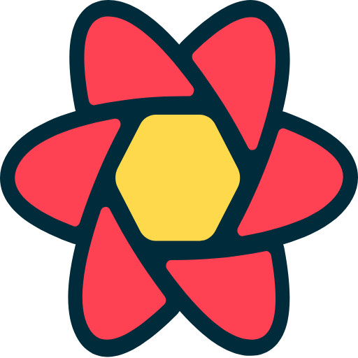
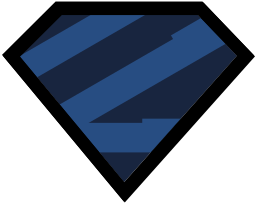
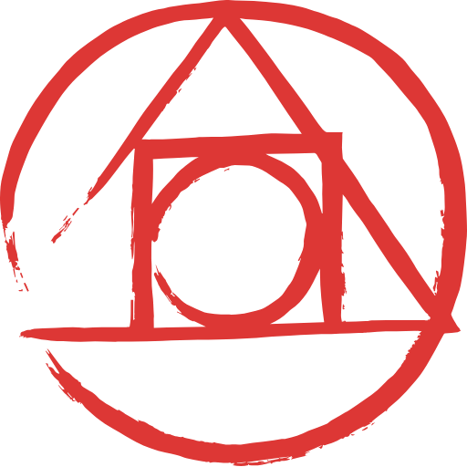
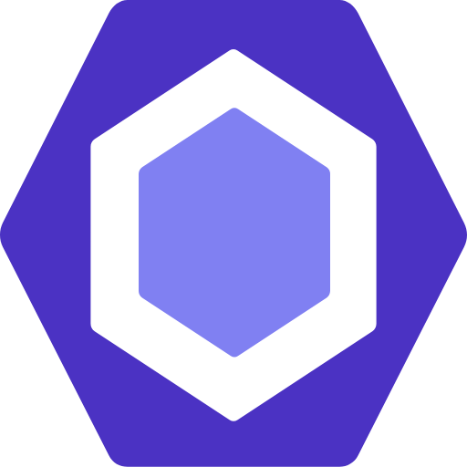

Hi My name is abas
=================================================================================================================================
  
#  

Crafting Experiences Through Code Front-end Wizard at Work
Coding artisan with a Persian touch! 🌟 Transforming ideas into captivating user interfaces. Passionate about crafting seamless experiences that blend innovation and elegance. Dedicated to the art of front-end development, I weave code into visual poetry. Let's build a digital masterpiece together! 💻✨

### Programming and markup languages:

<a href="https://sass-lang.com/" target="_blank" rel="noreferrer">
  
  
  
  
  
</a>
   
   
   
    
    
    
    
    

### Tools :

   

   

 
  
  

<!--   -->
 
<!--     -->

#  
